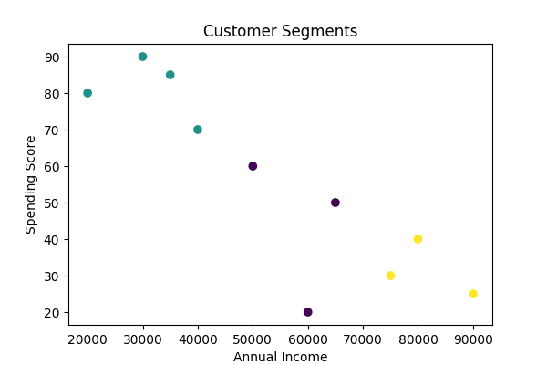

# Customer Segmentation using K-Means Clustering

## Overview
This project applies K-Means clustering to segment customers based on income and spending behavior. This can help businesses target marketing strategies more effectively.

## Tools Used
- Python (Pandas, Scikit-learn, Matplotlib)
- Excel (data exploration)
- Tableau (visualization placeholder)

## Dataset
Mock dataset with:
- Age
- Annual Income
- Spending Score
- Customer Lifetime Value (CLV)

## Steps
1. Load customer data
2. Apply K-Means clustering
3. Save segmented data
4. Visualize clusters

## Output
- Segmented dataset in `customer_segments.csv`
- Cluster plot in `cluster_plot.png`
- Placeholder Tableau dashboard screenshot

## Sample Visual

## QA Checks (What I Verified)
- Data sanity: No missing values in `AnnualIncome` and `SpendingScore`.
- Value ranges: `SpendingScore` between 0–100; `AnnualIncome` reasonable values.
- Reproducibility: `random_state=42` set for consistent clustering.
- Output validation: `customer_segments.csv` includes a `Cluster` column with 3 unique values (0,1,2).
- Visualization exists: `cluster_plot.png` is generated without errors.

## Dashboard Test Ideas (BI Perspective)
- Filter by cluster and verify counts match the CSV.
- Check summary stats per cluster (avg income, avg spending).
- Slice by `Age` buckets (18–25, 26–35, etc.) and verify totals.
- Export/Download: confirm CSV download matches filtered rows.
