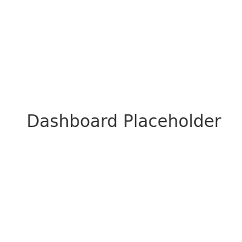

# Customer Segmentation using K-Means Clustering

## Overview
This project applies K-Means clustering to segment customers based on income and spending behavior. This can help businesses target marketing strategies more effectively.

## Tools Used
- Python (Pandas, Scikit-learn, Matplotlib)
- Excel (data exploration)
- Tableau (visualization placeholder)

## Dataset
Mock dataset with:
- Age
- Annual Income
- Spending Score
- Customer Lifetime Value (CLV)

## Steps
1. Load customer data
2. Apply K-Means clustering
3. Save segmented data
4. Visualize clusters

## Output
- Segmented dataset in `customer_segments.csv`
- Cluster plot in `cluster_plot.png`
- Placeholder Tableau dashboard screenshot

## Sample Visual

